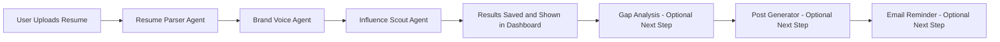

# LinkedIn Personal Branding Assistant

## 1. Introduction

The LinkedIn Personal Branding Assistant is an AI-driven web application that helps a user move from raw resume data to actionable LinkedIn content strategy.

The system combines:
- A frontend user interface for registration, login, analysis, and review.
- A FastAPI backend for orchestration and persistence.
- Multiple AI agents for profile extraction, branding, influencer discovery, strategy, and post writing.
- A scheduler for automated recurring content support.

Primary objective:
- Convert a user's professional profile into clear, personalized, and publish-ready LinkedIn growth assets.

## 2. Problem Statement

Most users struggle with:
- Turning resume details into brand positioning.
- Finding relevant influencers in their niche.
- Understanding the gap between their profile and top creators.
- Producing consistent, high-quality LinkedIn content.
- Maintaining posting consistency over time.

This project addresses those gaps through an agentic pipeline and a guided UI workflow.

## 3. Scope and Features

### 3.1 Core Features
- Resume upload during registration (PDF/DOC/DOCX).
- Secure login using hashed passwords and JWT token issuance.
- AI pipeline to parse resume, generate brand voice, and identify influencers.
- Guided manual continuation for gap analysis, post generation, and reminder send.
- Automated scheduled pipeline for recurring content cycles.
- Persistent storage of user profile cache and per-agent outputs.

### 3.2 Out of Scope (Current Version)
- Full enterprise-grade authorization middleware on all routes.
- Multi-tenant role management.
- Production deployment hardening beyond development defaults.

## 4. Technology Stack

### 4.1 Backend
- FastAPI
- SQLAlchemy async + aiosqlite
- LangGraph + LangChain + Groq
- APScheduler
- PyJWT + passlib
- PyPDF2 + python-docx

### 4.2 Frontend
- HTML
- CSS
- Vanilla JavaScript

### 4.3 External Integrations
- Groq API for LLM generation
- Serper API for search and image search
- DuckDuckGo fallback search
- SMTP (Office365 defaults) for email reminders

## 5. Project Structure

Top level:
- backend/
- frontend/
- EMAIL_REMINDER_SETUP.md
- COMPLETE_FLOW_DOCUMENTATION.md
- PROJECT_DETAILED_DOCUMENTATION.md

Important backend modules:
- backend/main.py
- backend/database.py
- backend/models.py
- backend/schemas.py
- backend/routes/auth.py
- backend/routes/pipeline.py
- backend/agents/
- backend/scheduler.py

## 6. System Architecture

High-level architecture:
1. Frontend collects user input and sends API calls.
2. Backend authenticates user and orchestrates agents.
3. Agents call LLM/search/email services.
4. Database stores user state and agent outputs.
5. Scheduler triggers automated flows for eligible users.

### 6.1 Startup Sequence
1. FastAPI app initializes.
2. Database tables initialize/migrate.
3. Scheduler starts hourly checks.
4. Routers are mounted.
5. Frontend static files are served at root path.

## 7. Configuration and Environment Variables

Required:
- GROQ_API_KEY
- SECRET_KEY
- DATABASE_URL

Recommended:
- SERPER_API_KEY
- GROQ_MODEL
- RESUME_PARSER_MODEL
- BRAND_VOICE_MODEL
- PIPELINE_TIMEOUT_SECONDS

Rate-limit tuning:
- GROQ_MIN_INTERVAL_SECONDS
- GROQ_MAX_RETRIES
- GROQ_RETRY_BASE_SECONDS

Email reminder:
- EMAIL_SENDER
- EMAIL_PASSWORD
- EMAIL_SMTP_SERVER
- EMAIL_SMTP_PORT

## 8. Database Design

### 8.1 users Table
Stores:
- identity and auth fields
- resume metadata
- parsed profile cache
- brand voice cache
- posting schedule fields
- last automated run timestamp

### 8.2 agent_outputs Table
Stores per-agent execution records:
- agent name and status
- output JSON payload
- error message
- saved flag
- timestamps

### 8.3 Data Strategy
- users table holds reusable current state.
- agent_outputs table holds execution history and traceability.

## 9. Backend API Design

### 9.1 Auth Endpoints
- POST /api/register
- POST /api/login
- GET /api/user/{user_id}

### 9.2 Pipeline Endpoints
- POST /api/pipeline/run
- GET /api/pipeline/live-status/{user_id}
- GET /api/pipeline/results/{user_id}
- POST /api/pipeline/save-result
- POST /api/pipeline/gap-analysis
- POST /api/pipeline/generate-posts
- POST /api/pipeline/send-reminder

## 10. Agent Pipeline Design

### 10.1 Manual Pipeline (Current Graph)
Order in run_pipeline:
1. Resume Parser Agent
2. Brand Voice and Persona Agent
3. Influence and Idol Scout Agent

### 10.2 Manual Continuation (Endpoint-Driven)
After initial graph, user continues with:
1. Gap Analysis endpoint
2. Post Generation endpoint
3. Send Reminder endpoint

### 10.3 Automated Pipeline (Scheduler Graph)
Order in run_automated_pipeline:
1. Influence Scout Agent
2. Gap Analysis Agent
3. Post Generation Agent
4. Email Reminder Agent

## 10A. Non-Technical Workflow Explanation (For Business Readers)

### 10A.1 Executive Summary
Think of this system as a team of AI specialists that work in sequence.

1. The first specialist reads the resume and turns it into structured profile data.
2. The second specialist decides the person's professional brand voice.
3. The third specialist finds relevant industry influencers to learn from.
4. Additional specialists (gap analysis, post generation, reminder email) are available for continuation and automation.

In simple terms:
- Input: Resume + basic user account details.
- Processing: Multi-agent AI analysis.
- Output: Clear brand direction, influencer references, and content guidance.

### 10A.2 Visual Pipeline (Simple View)

### 10A.3 What Happens When User Clicks "Run Analysis"
1. System validates logged-in user and resume availability.
2. System starts the core 3-agent pipeline.
3. Each agent runs one-by-one and records success or error.
4. All outputs are saved in database for future viewing.
5. Dashboard shows final cards with outputs.

Important behavior:
- If one step fails, the system does not hide the problem.
- It stores a readable error message and marks dependent steps as skipped.

### 10A.4 Agent-by-Agent Explanation (Plain Language)

#### Agent 1: Resume Parser Agent
Purpose:
- Reads resume content and converts it into structured profile information.

Input:
- Resume file (PDF/DOC/DOCX).

What it does:
1. Extracts text from the file.
2. Uses AI to identify details like experience, skills, education, summary, and role context.
3. Returns clean JSON output for downstream agents.

Output examples:
- Personal details.
- Work history.
- Technical and soft skills.
- Expertise areas.

Business value:
- Converts unstructured resume text into machine-usable profile intelligence.

#### Agent 2: Brand Voice and Persona Agent
Purpose:
- Builds a professional communication identity for LinkedIn.

Input:
- Parsed profile data from Agent 1.

What it does:
1. Looks at user profile strengths and positioning.
2. Pulls additional industry context (search-based enrichment).
3. Generates a personalized brand voice and messaging strategy.

Output examples:
- Professional identity statement.
- Tone and style guidelines.
- Suggested content themes.
- Bio, elevator pitch, and hashtag set.

Business value:
- Creates consistency in how the user should present themselves online.

#### Agent 3: Influence and Idol Scout Agent
Purpose:
- Finds relevant LinkedIn influencers in the same niche.

Input:
- Parsed profile + brand voice.

What it does:
1. Creates a focused search query based on user niche.
2. Searches for matching LinkedIn profiles.
3. Returns a curated influencer list.

Output examples:
- Search query used.
- Influencer profile links.
- Short snippets for quick evaluation.

Business value:
- Provides real benchmark profiles for positioning and content inspiration.

### 10A.5 Optional/Extended Agents (Continuation Stage)

#### Agent 4: Gap Analysis and Content Strategist
Purpose:
- Compares user profile against selected influencer and identifies missing elements.

Output:
- Gap summary.
- Content pillars.
- Suggested posting plan.

#### Agent 5: LinkedIn Post Generator
Purpose:
- Converts strategy into ready-to-publish post drafts.

Output:
- Structured post drafts with clear topic direction and intent.

#### Agent 6: Email Reminder Agent
Purpose:
- Sends generated content as reminder mail for execution discipline.

Output:
- Delivery status and reminder trace.

### 10A.6 Data Movement (Non-Technical View)
1. User data enters through frontend forms.
2. Backend validates and triggers workflow.
3. Each agent receives previous agent output.
4. Every result is saved as a separate record.
5. Frontend reads these records and renders user-friendly cards.

### 10A.7 Why This Design Is Useful for Non-Technical Teams
1. Transparent: Each step is visible and auditable.
2. Explainable: Output is grouped by specialist role.
3. Recoverable: Failures are isolated and reported clearly.
4. Extensible: More agents can be added without redesigning the whole product.
5. Practical: Users can move from resume to publishing strategy in one guided flow.

### 10A.8 One-Line Summary
This pipeline turns a resume into a practical LinkedIn growth system by passing the user through specialized AI experts, each adding one clear layer of value.

## 11. Frontend Workflow

Main user journey:
1. Register with resume upload.
2. Login and session restore.
3. Run analysis pipeline.
4. Review agent outputs.
5. Select influencers.
6. Run gap analysis.
7. Generate posts.
8. Send reminder email.

UX support behavior:
- Live polling for pipeline wait/retry status.
- Dynamic action panel based on completed steps.
- Incremental output rendering by agent card.

## 12. Detailed End-to-End Data Flow

### 12.1 Manual Flow
1. User registers and uploads resume.
2. Backend stores user and resume path.
3. User logs in and receives token.
4. User triggers /pipeline/run.
5. Backend runs manual agent graph.
6. Agent outputs are persisted.
7. Parsed profile and brand voice caches are updated.
8. User chooses influencer(s) and triggers gap analysis.
9. User triggers post generation from chosen strategy.
10. User triggers reminder send.

### 12.2 Automated Flow
1. Scheduler checks users every hour.
2. Verifies schedule/day/hour/cache readiness.
3. Runs automated graph from cached data.
4. Updates last_automated_post_at.

## 13. Reliability and Error Handling

Implemented safeguards:
- Try/except handling in routes and agents.
- Timeout guard for pipeline execution.
- Groq spacing + retry + backoff logic.
- JSON cleanup before parse from LLM responses.
- Search fallback from Serper to DuckDuckGo.
- Graceful email warning if SMTP config missing.

Operational files may include:
- backend/pipeline_error.log
- backend/pipeline_log.txt
- backend/server_debug.log

## 14. Challenges I Am Facing (Detailed)

This section captures the practical issues currently being faced during development and operation.

### 14.1 Frontend UI and Design Challenges
Problem:
- Building a clean, modern, and intuitive UI that still supports complex multi-step AI workflows.

Observed difficulty:
- Output cards can become very dense and hard to scan.
- Interaction flow feels long for first-time users.
- Keeping mobile responsiveness and clarity for complex data blocks is difficult.

Impact:
- Users may feel overwhelmed even when outputs are correct.
- Drop-off risk between influencer selection and post generation steps.

Current workaround:
- Dynamic cards and progressive sections are implemented.
- Step-wise actions are shown based on available results.

Needed next improvements:
1. Add stronger visual hierarchy (summary blocks before full details).
2. Add compact mode for long outputs.
3. Improve onboarding hints/tooltips for each stage.
4. Introduce dedicated mobile layout rules for dense content areas.

### 14.2 Frontend and Backend Connection Challenges
Problem:
- Coordinating frontend state with backend pipeline status and multi-endpoint workflow.

Observed difficulty:
- Sequence depends on previous outputs and cache consistency.
- Error messaging may not always map clearly to user actions.
- Authorization token is sent from frontend, but backend route protection can be strengthened.

Impact:
- Harder debugging when flow breaks between steps.
- Potential mismatch between what UI expects and what backend returns.

Current workaround:
- Session storage for auth and user context.
- Live-status polling during pipeline runs.
- Fallback behavior for loading previous results.

Needed next improvements:
1. Add route-level auth dependencies to protected pipeline endpoints.
2. Standardize API error response format for easier frontend handling.
3. Add request/response logging IDs for traceability across UI and API.

### 14.3 LinkedIn Search Query Quality Challenges
Problem:
- Generating high-quality search queries that consistently return relevant niche influencers.

Observed difficulty:
- LLM query output may become verbose or generic.
- Search relevance varies by user industry specificity.

Impact:
- Influencer list quality can fluctuate.
- Downstream gap analysis quality depends on influencer relevance.

Current workaround:
- Query sanitization in influencer agent.
- Serper primary search + DuckDuckGo fallback.

Needed next improvements:
1. Add post-query scoring and refinement loop.
2. Add domain-specific query templates per industry.
3. Add relevance filters (keyword coverage, profile strength indicators).

### 14.4 Post Generation Quality Challenges
Problem:
- Producing posts that are consistently natural, useful, and niche-relevant.

Observed difficulty:
- Variation in post depth and specificity across runs.
- Balancing structure with human tone is not always perfect.
- Some generated outputs may still feel generic.

Impact:
- User trust drops if posts require heavy manual editing.
- Engagement potential decreases for generic content.

Current workaround:
- Strong prompting rules for tone, grammar, hooks, and CTA.
- Gap-analysis-informed generation context.
- Image enrichment support for better post packaging.

Needed next improvements:
1. Add post quality scoring before returning outputs.
2. Add regeneration controls per post type.
3. Add user feedback loop to fine-tune future outputs.

### 14.5 Free Tool Discovery for Influencer Post Analysis
Problem:
- Difficulty finding reliable free tools for deep influencer post analysis.

Observed difficulty:
- Many tools are paid or heavily limited.
- Free options often lack stable APIs or structured data.

Impact:
- Limits depth of external influencer benchmarking.
- Creates dependency on broad web search snippets instead of richer metrics.

Current workaround:
- Use Serper and DuckDuckGo search-derived profile context.
- Rely on LLM reasoning over available snippets.

Needed next improvements:
1. Build lightweight internal scraper/collector with compliance checks.
2. Store historical influencer snapshots in DB for comparison.
3. Integrate optional paid source only for premium analysis mode.

### 14.6 Handling Frontend Complexity as a Solo Builder
Problem:
- Managing design, interaction architecture, and debugging together is heavy.

Observed difficulty:
- UI logic and state flow in one file can become harder to maintain.
- Reusable components are limited in vanilla JS structure.

Impact:
- Slower iteration and higher bug probability.

Needed next improvements:
1. Split frontend logic into modules.
2. Introduce component-style rendering helpers.
3. Add UI test checklist for major interaction paths.

## 15. Setup and Run Guide

1. Create virtual environment and install backend dependencies.
2. Configure backend/.env with required keys.
3. Start server via backend/main.py.
4. Open browser at http://localhost:8000.
5. Run full user journey from registration to reminder send.

## 16. Testing and Utility Scripts

Useful scripts in backend:
- run_full_pipeline.py
- test_endpoints.py
- test_pipeline.py
- test_post_agent.py
- test_scheduler.py
- seed_user.py
- check_db.py
- debug_schema.py
- delete_user.py

## 17. Current Limitations and Improvement Plan

Known limitations:
- Manual run endpoint currently executes only first three agents.
- Token issuance exists, but protection middleware can be strengthened.
- Development CORS is permissive.
- SQLite may not scale for high concurrency production load.

Improvement plan:
1. Strengthen auth middleware for protected routes.
2. Introduce migration framework (Alembic).
3. Improve observability and structured logging.
4. Add CI tests for core flow.
5. Evolve frontend into modular maintainable structure.
6. Expand influencer analysis depth and post-quality control.

## 18. Conclusion

This project already provides a strong agentic foundation for LinkedIn personal branding automation, from resume ingestion to strategy and content output. The key next maturity step is not basic functionality, but consistency and product polish: better UI clarity, stronger frontend-backend contract reliability, improved influencer query precision, and post-quality assurance.

With the documented challenge areas and improvement actions, the project has a clear roadmap from a working intelligent prototype to a robust production-grade platform.